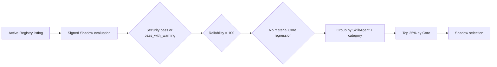

<h1 align="center">Awesome Quantskills</h1>

<p align="center"><strong>A verified Shadow-scored selection of quantitative Skills and Agents</strong></p>

<p align="center">    </p>

<p align="center"><a href="README.md">中文</a> · <a href="https://www.quantskills.ai/">Quantskills website</a> · <a href="https://github.com/quantskills/registry">Full Registry</a> · <a href="data/awesome-quantskills.json">AI data</a></p>

> [!IMPORTANT]
> This repository is a research-only **Shadow selection view**. It does not change Registry admission, imply certification, or constitute investment advice.

**28** selected · **25** Skills · **3** Agents · **10** categories. Current snapshot: `sha256:276e68899f6db4a7570a1b13cd84231f94987469343002522270686e52e87091`.

## Quick navigation

- [01 Data APIs & Warehouse](#category-01) · 1 item
- [02 Factor R&D Toolbox](#category-02) · 2 items
- [03 Market & Instrument Analysis](#category-03) · 10 items
- [04 Risk Monitoring & Alerts](#category-04) · 4 items
- [05 Backtesting & Trading](#category-05) · 2 items
- [06 Research Models & Replication](#category-06) · 2 items
- [07 Research Validation & Quality](#category-07) · 1 item
- [08 Information Search & Knowledge Analysis](#category-08) · 2 items
- [09 Quant Agents & Automation](#category-09) · 3 items
- [10 Infrastructure & Templates](#category-10) · 1 item

## How selection works



- Ranking uses **Core**, not Featured; ties are resolved by `asset_id`.
- Each group selects `ceil(eligible count × 25%)`, with a minimum of one.
- Featured N/A does not automatically exclude an item; a material Core regression does.
- The collection is recalculated with new scores and Registry snapshots, so entries may move in or out.

## Selected projects

**Score guide**

- `Core = 50% B + 25% Q + 25% T`, on a 0–100 scale where higher is better.
- `B` is behavior, `Q` is output quality, and `T` is token efficiency.
- Group rank compares only projects of the same type and top-level category; ranks are not directly comparable across categories.

<a id="category-01"></a>

### 01 · Data APIs & Warehouse

Project | Type | Core | B / Q / T | Group rank | Summary
--- | --- | ---: | --- | ---: | ---
[skill-corporate-action-adjustment-auditor](https://github.com/quantskills/skill-corporate-action-adjustment-auditor) | Skill | **80.82** | 98.80 / 80.62 / 45.05 | 1/3 | Audits split and cash-dividend consistency between raw and adjusted equity prices before research.

<a id="category-02"></a>

### 02 · Factor R&D Toolbox

Project | Type | Core | B / Q / T | Group rank | Summary
--- | --- | ---: | --- | ---: | ---
[skill-factor-orthogonalize](https://github.com/quantskills/skill-factor-orthogonalize) | Skill | **76.07** | 95.71 / 73.75 / 39.10 | 1/5 | Orthogonalizes cross-sectional factors with daily OLS and outputs residual factors and exposure diagnostics.
[skill-factor-mining-pandaai](https://github.com/quantskills/skill-factor-mining-pandaai) | Skill | **75.42** | 89.98 / 80.00 / 41.75 | 2/5 | Mines factors with PandaAI data and feedback or extracts them from public documents.

<a id="category-03"></a>

### 03 · Market & Instrument Analysis

Project | Type | Core | B / Q / T | Group rank | Summary
--- | --- | ---: | --- | ---: | ---
[skill-buffett-moat-screener](https://github.com/quantskills/skill-buffett-moat-screener) | Skill | **82.08** | 99.18 / 91.88 / 38.07 | 1/38 | Screens A-share and US companies using moat, valuation, and point-in-time data for research records.
[skill-ag-futures-seasonality](https://github.com/quantskills/skill-ag-futures-seasonality) | Skill | **80.73** | 98.48 / 86.88 / 39.08 | 2/38 | Computes monthly agricultural-futures seasonality from daily prices and overlays crop-calendar context.
[skill-futures-hedgecraft](https://github.com/quantskills/skill-futures-hedgecraft) | Skill | **79.70** | 99.82 / 80.62 / 38.55 | 3/38 | 当需要设计、审查或排错期货对冲、期货仓位 sizing、合约移仓、基差/carry 分析、日历价差、保证金压力测试或 CTA 风格期货配置时，使用此 skill。适用于股指期货、商品期货、利率期货和跨期价差场景，重点处理合约乘数、名义本金、保证金、期限结构、交割规则和压力损失。
[skill-buffett-moat-screener--lavineversion](https://github.com/quantskills/skill-buffett-moat-screener--lavineversion) | Skill | **79.36** | 99.58 / 77.50 / 40.78 | 4/38 | PandaData-only point-in-time Buffett moat hard screener for A-shares.
[skill-post-market-screener](https://github.com/quantskills/skill-post-market-screener) | Skill | **79.11** | 98.37 / 80.00 / 39.72 | 5/38 | Screens A-share stocks after market close using technical patterns and capital-flow evidence.
[skill-global-commodity-term-structure](https://github.com/quantskills/skill-global-commodity-term-structure) | Skill | **79.03** | 99.76 / 76.25 / 40.37 | 6/38 | Uses public data to study global commodity-futures term structure, roll yield, and spreads.
[skill-stock-memory-analyzer-usa](https://github.com/quantskills/skill-stock-memory-analyzer-usa) | Skill | **78.78** | 98.79 / 78.12 / 39.41 | 7/38 | Performs multidimensional research analysis of US memory-chip stocks.
[skill-hk-us-consensus-revision-radar](https://github.com/quantskills/skill-hk-us-consensus-revision-radar) | Skill | **78.72** | 99.56 / 73.75 / 42.01 | 8/38 | Organizes cross-period HK/US target-price and rating revisions into a research report.
[skill-option-strategy-builder](https://github.com/quantskills/skill-option-strategy-builder) | Skill | **78.49** | 98.44 / 78.12 / 38.97 | 9/38 | Builds option strategies with legs, payoff charts, breakevens, Greeks, and margin analysis.
[skill-index-rebalance-event-study](https://github.com/quantskills/skill-index-rebalance-event-study) | Skill | **78.35** | 98.28 / 78.12 / 38.70 | 10/38 | Runs reproducible event studies for index additions, deletions, and weight changes.

<a id="category-04"></a>

### 04 · Risk Monitoring & Alerts

Project | Type | Core | B / Q / T | Group rank | Summary
--- | --- | ---: | --- | ---: | ---
[skill-quant-portfolio-risk](https://github.com/quantskills/skill-quant-portfolio-risk) | Skill | **75.71** | 99.19 / 82.50 / 21.96 | 1/16 | Analyzes portfolio risk exposures, constraints, and stress scenarios.
[skill-capital-flow-crowding-monitor](https://github.com/quantskills/skill-capital-flow-crowding-monitor) | Skill | **74.97** | 99.71 / 78.12 / 22.35 | 2/16 | Aggregates margin, northbound-holding, and block-trade data into consensus, divergence, and crowding-percentile signals.
[skill-portfolio-liquidity-stress-test](https://github.com/quantskills/skill-portfolio-liquidity-stress-test) | Skill | **73.93** | 97.93 / 78.12 / 21.74 | 3/16 | Estimates portfolio liquidation days, horizon cash, redemption shortfalls, and impact costs under volume stress.
[skill-a-share-market-risk-radar](https://github.com/quantskills/skill-a-share-market-risk-radar) | Skill | **73.27** | 98.35 / 72.50 / 23.86 | 4/16 | Scans A-share macro, funding, valuation, trend, sector-rotation, and event evidence into risk levels.

<a id="category-05"></a>

### 05 · Backtesting & Trading

Project | Type | Core | B / Q / T | Group rank | Summary
--- | --- | ---: | --- | ---: | ---
[skill-transaction-cost-calibration](https://github.com/quantskills/skill-transaction-cost-calibration) | Skill | **80.51** | 99.44 / 78.12 / 45.03 | 1/7 | Calibrates commission, spread, slippage, and market-impact assumptions from execution and market data.
[skill-portfolio-optimize](https://github.com/quantskills/skill-portfolio-optimize) | Skill | **75.26** | 97.97 / 66.88 / 38.23 | 2/7 | Turns alpha signals into optimized weights under weight, sector, exposure, and turnover constraints.

<a id="category-06"></a>

### 06 · Research Models & Replication

Project | Type | Core | B / Q / T | Group rank | Summary
--- | --- | ---: | --- | ---: | ---
[skill-ah-share-relative-value-montior](https://github.com/quantskills/skill-ah-share-relative-value-montior) | Skill | **81.30** | 99.78 / 83.12 / 42.53 | 1/8 | Monitor FX-adjusted A/H premiums, historical extremes, dislocations, and daily cross-market price-discovery proxies.
[skill-x-trader-builder](https://github.com/quantskills/skill-x-trader-builder) | Skill | **79.50** | 97.45 / 82.50 / 40.60 | 2/8 | Builds trader-specific research-model skills from public X/Twitter post data.

<a id="category-07"></a>

### 07 · Research Validation & Quality

Project | Type | Core | B / Q / T | Group rank | Summary
--- | --- | ---: | --- | ---: | ---
[skill-backtest-assumption_check](https://github.com/quantskills/skill-backtest-assumption_check) | Skill | **79.74** | 97.07 / 85.62 / 39.19 | 1/4 | Use when an agent needs to independently audit the assumptions and biases behind a backtest / strategy code / research backtest report — execution ti…

<a id="category-08"></a>

### 08 · Information Search & Knowledge Analysis

Project | Type | Core | B / Q / T | Group rank | Summary
--- | --- | ---: | --- | ---: | ---
[skill-earnings-event-study](https://github.com/quantskills/skill-earnings-event-study) | Skill | **79.36** | 99.34 / 79.38 / 39.38 | 1/8 | Formal CAR event study around earnings/corporate events — abnormal returns, multi-window CARs, t-tests and sign tests, with sample and model disclosu…
[skill-disclosure-event-extractor](https://github.com/quantskills/skill-disclosure-event-extractor) | Skill | **78.90** | 99.24 / 82.50 / 34.61 | 2/8 | Turn unstructured A-share disclosure text from cninfo (巨潮) and the SSE/SZSE exchanges into a traceable, structured event table (监管问询/诉讼担保/重组/治理/ 停牌控制…

<a id="category-09"></a>

### 09 · Quant Agents & Automation

Project | Type | Core | B / Q / T | Group rank | Summary
--- | --- | ---: | --- | ---: | ---
[agent-alpha-portfolio-guardian](https://github.com/quantskills/agent-alpha-portfolio-guardian) | Agent | **79.79** | 97.46 / 82.50 / 41.74 | 1/12 | Multi-factor portfolio health guardian producing a health matrix, crowding alerts, retire/rebuild candidates, IC decay curves, and a research-only ef…
[agent-for-liangshuyuan-tasks](https://github.com/quantskills/agent-for-liangshuyuan-tasks) | Agent | **78.03** | 98.76 / 74.38 / 40.21 | 2/12 | Multi-agent collaboration framework for Liangshuyuan tasks, organizing quantitative tools, build workflows, and task roles.
[agent-correlation-break-research](https://github.com/quantskills/agent-correlation-break-research) | Agent | **76.49** | 96.88 / 71.88 / 40.32 | 3/12 | Uses Pandadata price-series correlation changes to identify style shifts, diversification stress, and structural market moves.

<a id="category-10"></a>

### 10 · Infrastructure & Templates

Project | Type | Core | B / Q / T | Group rank | Summary
--- | --- | ---: | --- | ---: | ---
[skill-pandaai-workflow-generator](https://github.com/quantskills/skill-pandaai-workflow-generator) | Skill | **72.49** | 90.40 / 71.88 / 37.29 | 1/2 | Generates importable PandaAI workflow JSON and embedded strategy or factor code from quant ideas.

## Use with AI

Machine-readable collection: [`data/awesome-quantskills.json`](data/awesome-quantskills.json)

```text
Read https://raw.githubusercontent.com/quantskills/awesome-quantskills/main/data/awesome-quantskills.json
and analyze the selected projects by category. Treat core as the primary score and
behavior/quality/token as components. Treat Featured as supplemental. Explain group rank,
source publication, and Shadow limitations. Do not provide investment advice.
```

## Provenance and integrity

- Authoritative source: [`quantskills/registry/evaluations`](https://github.com/quantskills/registry/tree/main/evaluations)
- Selection policy: `shadow-category-quartile.v1`
- Public evaluation snapshot digest: `53178a1362d5946361a73ad5c2384655106a7c93544e6164369ac735299693c0`
- Selection policy digest: `c7d2ba0470739c5319ca4011fa2abb8739551fe01beae2113365a3f26ef5f4e2`
- This repository stores only public redacted fields, never credentials, full signed envelopes, model traces, or detailed security findings.

Automated sync verifies the manifest, file SHA-256 values, score dataset binding, policy digest, and catalog snapshot before generating any output.

## Contributing

Direct README edits cannot add a project. A project must first enter the [Quantskills Registry](https://github.com/quantskills/registry), complete the current Shadow evaluation, and rank in its group's top quartile. See [CONTRIBUTING.md](CONTRIBUTING.md).

## License

The curation, scripts, and presentation in this repository use the [MIT License](LICENSE). Each listed project retains its own repository license.
