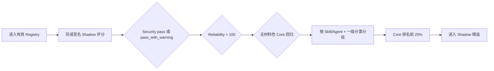

<h1 align="center">Awesome Quantskills</h1>

<p align="center"><strong>由可验证 Shadow 评分自动生成的量化 Skill 与 Agent 精选</strong></p>

<p align="center">    </p>

<p align="center"><a href="README.en.md">English</a> · <a href="https://www.quantskills.ai/">Quantskills 官网</a> · <a href="https://github.com/quantskills/registry">完整 Registry</a> · <a href="data/awesome-quantskills.json">AI 数据</a></p>

> [!IMPORTANT]
> 本库是研究用途的 **Shadow 精选视图**。它不改变 Registry 准入状态，不代表官方认证，也不构成投资建议。

**28** 项精选 · **25** Skills · **3** Agents · **10** 个分类。当前快照：`sha256:276e68899f6db4a7570a1b13cd84231f94987469343002522270686e52e87091`。

## 快速导航

- [01 数据接口与数据仓库](#category-01) · 1 项
- [02 因子研发工具箱](#category-02) · 2 项
- [03 市场与标的分析](#category-03) · 10 项
- [04 风险监控与预警](#category-04) · 4 项
- [05 策略回测与交易工具](#category-05) · 2 项
- [06 投研模型与研究复现](#category-06) · 2 项
- [07 研究验证与质量工具](#category-07) · 1 项
- [08 资讯搜索与知识分析](#category-08) · 2 项
- [09 量化智能体与自动化](#category-09) · 3 项
- [10 基础设施与模板](#category-10) · 1 项

## 怎么进入精选



- 排名使用 **Core**，不是 Featured；同分按 `asset_id` 排序。
- 每组取 `ceil(合格数量 × 25%)`，最少 1 项。
- Featured 为 N/A 不会自动淘汰；存在材料性 Core 回归才会被门禁排除。
- 精选随评分和 Registry 快照重新计算，项目可能进入或退出。

## 精选目录

**评分速读**

- `Core = 50% B + 25% Q + 25% T`，满分 100，越高越好。
- `B` 是行为表现，`Q` 是产出质量，`T` 是 Token 效率。
- “组内排名”只在同类型、同一级分类内比较；不同分类不直接横向排名。

<a id="category-01"></a>

### 01 · 数据接口与数据仓库

项目 | 类型 | Core | B / Q / T | 组内排名 | 简介
--- | --- | ---: | --- | ---: | ---
[skill-corporate-action-adjustment-auditor](https://github.com/quantskills/skill-corporate-action-adjustment-auditor) | Skill | **80.82** | 98.80 / 80.62 / 45.05 | 1/3 | 在研究或回测前审计原始与复权价格中的拆分和现金分红一致性。

<a id="category-02"></a>

### 02 · 因子研发工具箱

项目 | 类型 | Core | B / Q / T | 组内排名 | 简介
--- | --- | ---: | --- | ---: | ---
[skill-factor-orthogonalize](https://github.com/quantskills/skill-factor-orthogonalize) | Skill | **76.07** | 95.71 / 73.75 / 39.10 | 1/5 | 对截面因子进行逐日OLS正交化，并输出残差因子和暴露诊断。
[skill-factor-mining-pandaai](https://github.com/quantskills/skill-factor-mining-pandaai) | Skill | **75.42** | 89.98 / 80.00 / 41.75 | 2/5 | 使用PandaAI数据和分析反馈进行因子挖掘，或从公开文档提取因子。

<a id="category-03"></a>

### 03 · 市场与标的分析

项目 | 类型 | Core | B / Q / T | 组内排名 | 简介
--- | --- | ---: | --- | ---: | ---
[skill-buffett-moat-screener](https://github.com/quantskills/skill-buffett-moat-screener) | Skill | **82.08** | 99.18 / 91.88 / 38.07 | 1/38 | 按巴菲特式护城河、估值和点时数据筛选 A 股与美股公司并生成研究记录。
[skill-ag-futures-seasonality](https://github.com/quantskills/skill-ag-futures-seasonality) | Skill | **80.73** | 98.48 / 86.88 / 39.08 | 2/38 | 从农产品期货日线计算各月份历史季节性并叠加作物日历生成可视化报告。
[skill-futures-hedgecraft](https://github.com/quantskills/skill-futures-hedgecraft) | Skill | **79.70** | 99.82 / 80.62 / 38.55 | 3/38 | 当需要设计、审查或排错期货对冲、期货仓位 sizing、合约移仓、基差/carry 分析、日历价差、保证金压力测试或 CTA 风格期货配置时，使用此 skill。适用于股指期货、商品期货、利率期货和跨期价差场景，重点处理合约乘数、名义本金、保证金、期限结构、交割规则和压力损失。
[skill-buffett-moat-screener--lavineversion](https://github.com/quantskills/skill-buffett-moat-screener--lavineversion) | Skill | **79.36** | 99.58 / 77.50 / 40.78 | 4/38 | 基于 PandaData 点时证据执行十年资本回报与护城河硬筛选。
[skill-post-market-screener](https://github.com/quantskills/skill-post-market-screener) | Skill | **79.11** | 98.37 / 80.00 / 39.72 | 5/38 | 收盘后结合技术形态和资金流筛选 A 股股票并生成报告。
[skill-global-commodity-term-structure](https://github.com/quantskills/skill-global-commodity-term-structure) | Skill | **79.03** | 99.76 / 76.25 / 40.37 | 6/38 | 用公开数据研究海外商品期货期限结构、展期收益和价差。
[skill-stock-memory-analyzer-usa](https://github.com/quantskills/skill-stock-memory-analyzer-usa) | Skill | **78.78** | 98.79 / 78.12 / 39.41 | 7/38 | 对美国存储芯片股票开展多维度研究分析。
[skill-hk-us-consensus-revision-radar](https://github.com/quantskills/skill-hk-us-consensus-revision-radar) | Skill | **78.72** | 99.56 / 73.75 / 42.01 | 8/38 | 组织港美股目标价和评级的跨期修订轨迹，并生成研究报告。
[skill-option-strategy-builder](https://github.com/quantskills/skill-option-strategy-builder) | Skill | **78.49** | 98.44 / 78.12 / 38.97 | 9/38 | 构建期权策略腿组合、损益图、盈亏平衡、希腊字母和保证金分析。
[skill-index-rebalance-event-study](https://github.com/quantskills/skill-index-rebalance-event-study) | Skill | **78.35** | 98.28 / 78.12 / 38.70 | 10/38 | 围绕指数纳入、剔除和权重调整公告或生效日运行可复现事件研究。

<a id="category-04"></a>

### 04 · 风险监控与预警

项目 | 类型 | Core | B / Q / T | 组内排名 | 简介
--- | --- | ---: | --- | ---: | ---
[skill-quant-portfolio-risk](https://github.com/quantskills/skill-quant-portfolio-risk) | Skill | **75.71** | 99.19 / 82.50 / 21.96 | 1/16 | 分析组合风险暴露、约束和压力情景。
[skill-capital-flow-crowding-monitor](https://github.com/quantskills/skill-capital-flow-crowding-monitor) | Skill | **74.97** | 99.71 / 78.12 / 22.35 | 2/16 | 聚合融资融券、北向持股和大宗交易，计算资金一致性、背离与拥挤度分位信号。
[skill-portfolio-liquidity-stress-test](https://github.com/quantskills/skill-portfolio-liquidity-stress-test) | Skill | **73.93** | 97.93 / 78.12 / 21.74 | 3/16 | 在成交量压力下估算组合清算天数、期限内变现、赎回缺口和冲击成本。
[skill-a-share-market-risk-radar](https://github.com/quantskills/skill-a-share-market-risk-radar) | Skill | **73.27** | 98.35 / 72.50 / 23.86 | 4/16 | 扫描 A 股宏观、资金、估值、趋势、行业轮动与个股事件并汇总风险等级。

<a id="category-05"></a>

### 05 · 策略回测与交易工具

项目 | 类型 | Core | B / Q / T | 组内排名 | 简介
--- | --- | ---: | --- | ---: | ---
[skill-transaction-cost-calibration](https://github.com/quantskills/skill-transaction-cost-calibration) | Skill | **80.51** | 99.44 / 78.12 / 45.03 | 1/7 | 从成交和市场数据校准佣金、价差、滑点与冲击成本假设。
[skill-portfolio-optimize](https://github.com/quantskills/skill-portfolio-optimize) | Skill | **75.26** | 97.97 / 66.88 / 38.23 | 2/7 | 将alpha信号转为受权重、行业、暴露和换手约束的优化组合权重。

<a id="category-06"></a>

### 06 · 投研模型与研究复现

项目 | 类型 | Core | B / Q / T | 组内排名 | 简介
--- | --- | ---: | --- | ---: | ---
[skill-ah-share-relative-value-montior](https://github.com/quantskills/skill-ah-share-relative-value-montior) | Skill | **81.30** | 99.78 / 83.12 / 42.53 | 1/8 | 监控A/H双重上市股票的汇率调整溢价、历史极值、脱钩与日频价格发现关系。
[skill-x-trader-builder](https://github.com/quantskills/skill-x-trader-builder) | Skill | **79.50** | 97.45 / 82.50 / 40.60 | 2/8 | 从公开 X/Twitter 帖子数据构建交易者专属研究模型技能。

<a id="category-07"></a>

### 07 · 研究验证与质量工具

项目 | 类型 | Core | B / Q / T | 组内排名 | 简介
--- | --- | ---: | --- | ---: | ---
[skill-backtest-assumption_check](https://github.com/quantskills/skill-backtest-assumption_check) | Skill | **79.74** | 97.07 / 85.62 / 39.19 | 1/4 | 独立的回测假设审计师：对回测代码/策略代码/研究报告按九大维度（成交时点、成本、涨跌停停牌、幸存者、多重比较、数据对齐、换手容量、基准、透明）逐条取证，输出缺陷×证据×严重度×影响×修复清单，配套可运行校验脚本。

<a id="category-08"></a>

### 08 · 资讯搜索与知识分析

项目 | 类型 | Core | B / Q / T | 组内排名 | 简介
--- | --- | ---: | --- | ---: | ---
[skill-earnings-event-study](https://github.com/quantskills/skill-earnings-event-study) | Skill | **79.36** | 99.34 / 79.38 / 39.38 | 1/8 | 对财报/公司事件做正式 CAR 事件研究：异常收益、多窗口累计异常收益、截面 t 检验与符号检验；披露样本量与模型，不输出买卖建议。
[skill-disclosure-event-extractor](https://github.com/quantskills/skill-disclosure-event-extractor) | Skill | **78.90** | 99.24 / 82.50 / 34.61 | 2/8 | Turn unstructured A-share disclosure text from cninfo (巨潮) and the SSE/SZSE exchanges into a traceable, structured event table (监管问询/诉讼担保/重组/治理/ 停牌控制…

<a id="category-09"></a>

### 09 · 量化智能体与自动化

项目 | 类型 | Core | B / Q / T | 组内排名 | 简介
--- | --- | ---: | --- | ---: | ---
[agent-alpha-portfolio-guardian](https://github.com/quantskills/agent-alpha-portfolio-guardian) | Agent | **79.79** | 97.46 / 82.50 / 41.74 | 1/12 | 多因子组合健康度守卫：健康度矩阵 + 拥挤警示 + 退休/重构候选 + IC 衰减曲线，含守卫规则有效性回测 L4。
[agent-for-liangshuyuan-tasks](https://github.com/quantskills/agent-for-liangshuyuan-tasks) | Agent | **78.03** | 98.76 / 74.38 / 40.21 | 2/12 | 面向量枢院任务的多 Agent 协作框架，组织量化交易工具、构建流程与任务分工。
[agent-correlation-break-research](https://github.com/quantskills/agent-correlation-break-research) | Agent | **76.49** | 96.88 / 71.88 / 40.32 | 3/12 | 用 Pandadata 多资产收益相关性变化识别风格切换、分散化压力与结构性行情。

<a id="category-10"></a>

### 10 · 基础设施与模板

项目 | 类型 | Core | B / Q / T | 组内排名 | 简介
--- | --- | ---: | --- | ---: | ---
[skill-pandaai-workflow-generator](https://github.com/quantskills/skill-pandaai-workflow-generator) | Skill | **72.49** | 90.40 / 71.88 / 37.29 | 1/2 | 根据量化想法生成可导入PandaAI的工作流JSON及策略或因子代码。

## 给 AI 使用

机器可读精选数据：[`data/awesome-quantskills.json`](data/awesome-quantskills.json)

```text
请读取 https://raw.githubusercontent.com/quantskills/awesome-quantskills/main/data/awesome-quantskills.json
按 category 分组分析精选项目。以 core 为主评分，behavior/quality/token 为分项；
Featured 只作附加评价。说明组内排名、来源 publication 和 Shadow 限制，不作投资建议。
```

## 数据来源与完整性

- 权威来源：[`quantskills/registry/evaluations`](https://github.com/quantskills/registry/tree/main/evaluations)
- 精选策略：`shadow-category-quartile.v1`
- 公开评分快照摘要：`53178a1362d5946361a73ad5c2384655106a7c93544e6164369ac735299693c0`
- 精选策略摘要：`c7d2ba0470739c5319ca4011fa2abb8739551fe01beae2113365a3f26ef5f4e2`
- 本仓库只保存公开脱敏字段，不保存凭据、完整签名信封、模型轨迹或详细安全发现。

自动同步会先验证 manifest、文件 SHA-256、评分数据绑定、策略摘要和 catalog snapshot；任一不一致都会停止生成。

## 贡献

不能通过直接编辑本 README 进入精选。请先让项目进入 [Quantskills Registry](https://github.com/quantskills/registry)，完成当前 Shadow 评分并满足同组前 25% 条件。流程详见 [CONTRIBUTING.md](CONTRIBUTING.md)。

## 许可

本仓库的整理、脚本和展示采用 [MIT License](LICENSE)。各项目仍遵循其各自仓库中的许可证。
